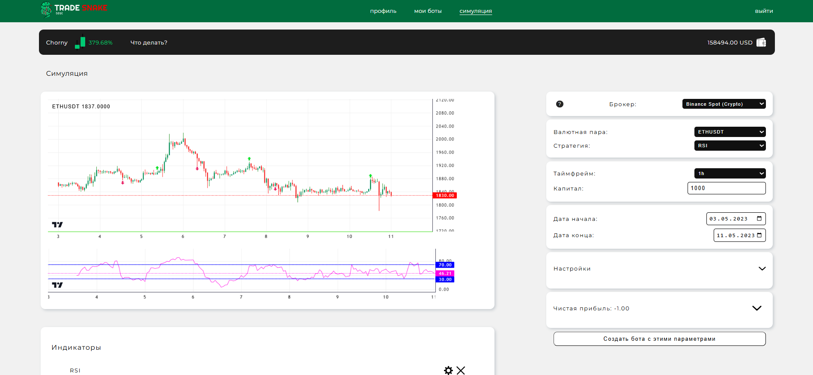

# Клиентская часть информационно-аналитической системы для тестирования торговых стратегий TradeSnake

## О проекте

TradeSnake — система для тестирования торговых стратегий на бирже.

Особенности:
- Тестирование на исторических и реальных данных
- Просмотр статистики портфеля ботов
- Гибкая настройка и создание ботов с готовыми стратегиями
- Обновление стратегий на серверной части

Финансовые графики: [Lightweight Charts](https://github.com/tradingview/lightweight-charts)  
Диаграммы: [Recharts](https://recharts.org/en-US/)  
Используется TypeScript для типизации.

---
## Быстрый старт

```bash
git clone https://github.com/ChornyChay1/TradeSnakeFront.git
cd diplom-teset
npm install
npm start
```
 
---
## Используемые библиотеки

- React  
- TypeScript  
- Lightweight Charts  
- Recharts  
- React Router DOM  
- js-cookie  
- Framer Motion  
- React Icons  
- Moment.js  

---

##  Презентация
### Интерфейс симуляции:


### GIF(может долго загружаться):


### Видео:
[Смотреть полное видео](https://disk.yandex.ru/i/vhMv9HwtXMg0Bg)

---
## Доступные роуты

| Путь                    | Описание                    |
|-------------------------|-----------------------------|
| `/`                     | Главная страница            |
| `/login`                | Страница входа              |
| `/register`             | Регистрация пользователя    |
| `/activate/:token`      | Активация аккаунта по токену|
| `/reset-password`       | Сброс пароля                |
| `/change-password/:token` | Изменение пароля по токену |
| `/profile`              | Профиль пользователя        |
| `/bots`                 | Список ботов пользователя   |
| `/simulation`           | Страница симуляции          |
| `/create-bot`           | Создание нового бота        |
| `/bot-settings/:bot_id` | Настройки конкретного бота  |

---
## Связанные репозитории

Backend основной: [BackEndMain](https://github.com/ChornyChay1/TradeSnakeBackPython)  
Backend торговый сервис: [BackEndС](https://github.com/ChornyChay1/TradeSnakeBackendC)  


 

